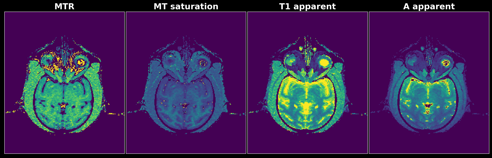

# __Magnetization Transfer saturation (MTsat) Imaging__

"MT_saturation_Imaging_MATLAB.m" display an example of __Magnetization Transfer saturation (MT sat) Imaging__ data analysis using __MATLAB__. MT sat imaging data analysis using __Python__ is exhibited in "MT_saturation_Imaging.ipybb" jupyter notebook. 

__MT saturation (MT sat)__ parameter estimation and model fitting is based on the method described by Helms et al. 2008 (https://onlinelibrary.wiley.com/doi/full/10.1002/mrm.21732).
### Prerequisite 
__Proton Density (PD)__-weighted images \
__T1__-weighted images \
__Magnetization Transfer (MT)__-weighted images

